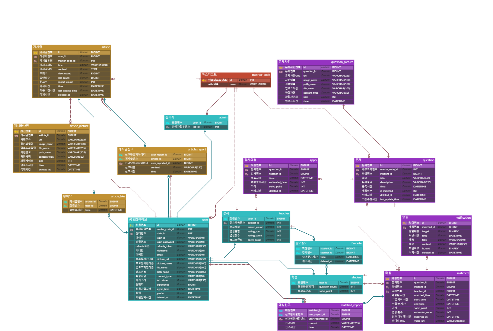

# A107 - 웹/모바일(웹 기술) 프로젝트

<!-- 필수 항목 -->

## 카테고리

| Application | Domain | Language | Framework |
| ---- | ---- | ---- | ---- |
| :white_check_mark: Desktop Web | :black_square_button: AI | :white_check_mark: JavaScript | :black_square_button: Vue.js |
| :white_check_mark: Mobile Web | :black_square_button: Big Data | :white_check_mark: TypeScript | :white_check_mark: React |
| :white_check_mark: Responsive Web | :black_square_button: Blockchain | :black_square_button: C/C++ | :black_square_button: Angular |
| :black_square_button: Android App | :black_square_button: IoT | :black_square_button: C# | :black_square_button: Node.js |
| :black_square_button: iOS App | :black_square_button: AR/VR/Metaverse | :black_square_button: Python | :black_square_button: Flask/Django |
| :black_square_button: Desktop App | :black_square_button: Game | :white_check_mark: Java | :white_check_mark: Spring/Springboot |
| | | :black_square_button: Kotlin | |

<!-- 필수 항목 -->

## 프로젝트 소개

* 프로젝트명: **Solive**
* 서비스 특징: 문제 별 1 대 1 화상 풀이 매칭 프로젝트
* 주요 기능
  - 회원 관리
  - 화상 문제 풀이 매칭
  - 게시판
* 주요 기술
  - WebRTC
  - WebSocket
  - JWT Authentication
  - REST API
* 참조 리소스
  * Tailwind CSS: 디자인 전반 적용
  * Material Tailwind: 디자인 전반 적용
  * OpenVidu: 오픈 소스 멀티 플랫폼 화상 회의 솔루션
  * JPA: 객체와 데이터베이스의 관계를 매핑
  * Querydsl: 쿼리 작성
* 배포 환경
  - URL: [https://i9a107.p.ssafy.io/](https://i9a107.p.ssafy.io/)
  <!-- 웹 서비스, 랜딩 페이지, 프로젝트 소개 등의 배포 URL 기입 -->
  - 테스트 계정:

    || 학생 | 선생님 |
    | ---- | ---- | ---- |
    | ID | gkrtod1 | tjstodsla1 |
    | PW | Gkrtod1! | Tjstodsla1! |

  <!-- 로그인이 필요한 경우, 사용 가능한 테스트 계정(ID/PW) 기입 -->

<!-- 자유 양식 -->

## 팀 소개
* 이효식: 팀장, 코드 리뷰 및 인프라 담당, CI/CD, HTTPS, Docker 구성
* 박민혁: 부팀장, 백엔드 및 프론트엔드 개발
* 이용현: 부부팀장, 백엔드 개발
* 노성호: 백엔드 개발 리더, 서기, UCC
* 정선재: 프론트엔드 개발 리더
* 최주호: 기획 및 와이어프레임 작성, UI/UX 디자인, WebRTC, 발표

<!-- 자유 양식 -->

## 프로젝트 상세 설명
### 개발 환경
| 분야 | 항목 | 버전 |
| ---- | ---- | ---- |
| 백엔드 | Java | 17 |
| 백엔드 | Gradle | 8.0 |
| 백엔드 |Spring boot | 3.1.1 |
| 프론트엔드 | React | 18 |
| 프론트엔드 | Node.js | 18.16.1 |
| 데이터베이스 | MySql | 8.0.33 |

### ERD
 
<!-- 개발 환경, 기술 스택, 시스템 구성도, ERD, 기능 상세 설명 등 -->
