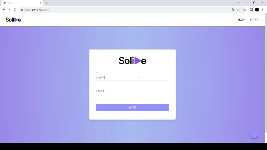

# 주의 사항

- Spring Boot는 Java 17 이상의 버전을 요구한다.
- OpenVidu를 서버에 배포하기 위해서는 최초에 80, 443 포트가 요구된다.
  - 때문에 nginx 보다 먼저 배포되어야 한다.
  - 이후, 포트를 변경하여 nginx가 사용가능하도록 해야 한다.
- Jenkins에는 초기에 설정한 Java의 버전에 의존적이므로, 프로젝트에 맞는 Java 버전을 이용한 Jenkins로 설치할 것을 권장한다.
  - Jenkins 설치 완료 후에도 Java 버전을 세팅하는 것은 가능하다.

---

# WebRTC

- WebRTC를 위해 오픈 소스인 OpenVidu를 사용
- OpenVidu 서버를 배포한 뒤 API를 가져다 씀

```
# root 계정으로 전환
sudo su
cd /opt

# Open vidu 설치
curl https://s3-eu-west-1.amazonaws.com/aws.openvidu.io/install_openvidu_latest.sh | bash

#Open vidu 디렉토리로 이동
cd openvidu

# 설정파일 수정
vi .env

# .env 파일 내에 다음 내용들을 찾아서 수정
DOMAIN_OR_PUBLIC_IP={서비스도메인}
OPENVIDU_SECRET={OpenVidu비밀번호}
CERTIFICATE_TYPE=letsencrypt
LETSENCRYPT_EMAIL= {인증서 발급 시 입력한 이메일}

# 앞에 '#'을 지워서 주석 해제 후 작성
# 최초에는 80, 443으로 시작
HTTP_PORT=80
HTTPS_PORT=443

# :wq! 입력후 엔터를 눌러 변경 내용 저장
```

이후 nginx를 사용한다면 포트를 변경

```
# .env 파일 내에 다음 내용들을 찾아서 수정
HTTP_PORT=8446
HTTPS_PORT=8447
```

실행 및 종료

```
### 실행 ###
# ubuntu firewall에 설정한 https 포트 등록
sudo ufw allow 8447

# openvidu 설치 위치로 이동
cd /opt/openvidu
./openvidu start

# Ctrl + C 눌러서 로그에서 빠져나옴

### 종료 ###
# openvidu 설치 위치로 이동
cd /opt/openvidu
./openvidu stop
```

OpenVidu의 관리자 계정

- ID: admin
- Password: {OpenVidu비밀번호}

OpenViude의 녹화 영상 확인 및 dashboard 계정

- ID: OPENVIDUAPP
- Password: {OpenVidu비밀번호}

---

# Server 구축

## 1. 서버 환경

### EC2

- EC2 접속
  - [MobaXterm](https://mobaxterm.mobatek.net/) 을 이용해서 접속 가능
    - ssh, sftp 모두 가능해서 편리
  - terminal(또는 cmd)이용
    - `ssh -i {pem_key_file} {계정명(대체로 unbuntu)}@{public_IP_address}`
  - FTP는 FileZilla, ssh는 Putty를 사용할 수 있지만, MobaXterm은 이 두 가지 기능을 모두 포함

### Docker-compose

- Docker compose를 이용해서 서버의 구성 요소(nginx, MySQL, Jenkins)의 image를 한꺼번에 continer를 만들어서 실행시킬 수 있음
- Docker-compose의 내용은 다음과 같음

  ````
  version: "3.8"
  services:
  mysql:
  image: mysql:8.0
  container_name: mysql
  ports: - {외부에서 접속하는 포트 번호}:3306 # HOST:CONTAINER
  environment:
  MYSQL_ROOT_PASSWORD: {root 비밀번호}
  command: - --character-set-server=utf8mb4 - --collation-server=utf8mb4_unicode_ci
  volumes: # Mount to local directory - /var/lib/mysql:/var/lib/mysql

  jenkins: # Jenkins Container # image: jenkins/jenkins:lts
  image: jenkins/jenkins:2.317-jdk17-preview # java17
  container_name: jenkins
  volumes: - /usr/bin/docker:/usr/bin/docker - /var/run/docker.sock:/var/run/docker.sock - /var/jenkins_home:/var/jenkins_home
  ports: - {외부에서 접속하는 포트 번호}:8080
  privileged: true
  user: root
  restart: unless-stopped

  nginx: # Nginx Container
  image: nginx
  container_name: nginx
  ports: - 80:80 - 443:443
  volumes: - /etc/nginx/conf.d:/etc/nginx/conf.d - /etc/letsencrypt:/etc/letsencrypt
  restart: unless-stopped

      ```
  ````

---

# Back-end

## 1. 개발 환경

### A. 개발 환경 정보

- Spring Boot: 3.1.1
- JDK: zulu-openjdk 17.0.8
- Gradle: 8.0
- Mysql: 8.0.33
- Querydsl: 5.0.0
- IntelliJ: 2023.2

### B. 개발 환경 세팅

i. JDK

1.  [zulu-openjdk 17.0.8](https://www.azul.com/downloads/?version=java-17-lts&os=windows&architecture=x86-64-bit&package=jdk#zulu) 에서 다운로드 및 설치
2.  cli 환경에서 설치(ubuntu)

    ```
    # apt-add-repository 설치
    apt-get install software-properties-common

    # azulsystem 저장소 추가
    apt-add-repository 'deb http://repos.azulsystems.com/ubuntu stable main'

    # 설치를 위한 키 등록
    apt-key adv --keyserver hkp://keyserver.ubuntu.com:80 --recv-keys 0xB1998361219BD9C9

    # zulu jdk 검색(Optional)
    apt-get update && apt-cache search zulu

    # zulu jdk 설치(jdk-17)
    apt-get install zulu-17
    ```

ii. Querydsl

- 빌드 및 배포의 `build.gradle` 참고

## 2. 빌드 및 배포

프로젝트에 필요한 인증키 정보는 main/resources/secret/application-secret.yml에 포함한다.
application-secret.yml에는 다음의 정보들이 포함된다.

```
# application-secret.yml

spring:

# database setting(MySQL)
  datasource:
    driver-class-name: com.mysql.cj.jdbc.Driver
    url: jdbc:mysql://{server_address}:{port}/{schema_name}?useSSL=false&serverTimezone=Asia/Seoul&characterEncoding=UTF-8
    username: {id}
    password: {password}

# S3 setting
  servlet:
    multipart:
      max-file-size: 10MB
      max-request-size: 10MB

# cloud front setting
cloud:
  aws:
    credentials:
      access-key: {IAM_accessKey}
      secret-key: {IAM_secretKey}
    region:
      static: {bucket_region}
    s3:
      bucket: {bucket_name}
    stack:
      auto: false
    cloudfront:
      domain: {domain_name}

# Jwt Token Secret Key
security:
  jwt:
    salt: {salt_value}
```

프로젝트를 빌드를 위한 `build.gradle` 파일은 다음과 같다.

```
plugins {
    id 'java'
    id 'org.springframework.boot' version '3.1.1'
    id 'io.spring.dependency-management' version '1.1.0'

//    id "com.ewerk.gradle.plugins.querydsl" version "1.0.10"
// 주의) 해당 plugin을 포함하는 경우, 빌드가 안 되는 문제가 발생할 수 있음
}

group = 'com.ssafy'
version = '0.0.1-SNAPSHOT'

java {
    sourceCompatibility = '17'
}

configurations {
    compileOnly {
        extendsFrom annotationProcessor
    }
}

repositories {
    mavenCentral()
}

dependencies {
    implementation 'org.springframework.boot:spring-boot-starter-data-jpa'
    implementation 'org.springframework.boot:spring-boot-starter-validation'
    implementation 'org.springframework.boot:spring-boot-starter-web'
    implementation 'com.github.gavlyukovskiy:p6spy-spring-boot-starter:1.9.0'
    compileOnly 'org.projectlombok:lombok'
    developmentOnly 'org.springframework.boot:spring-boot-devtools'
    runtimeOnly 'com.mysql:mysql-connector-j'
    annotationProcessor 'org.projectlombok:lombok'
    testImplementation 'org.springframework.boot:spring-boot-starter-test'

    //  https://mvnrepository.com/artifact/io.jsonwebtoken/jjwt
    implementation 'io.jsonwebtoken:jjwt:0.9.1'
    implementation 'javax.xml.bind:jaxb-api:2.3.0'

    //  Bcrypt
    implementation 'org.mindrot:jbcrypt:0.4'

    //  querydsl
    implementation 'com.querydsl:querydsl-jpa:5.0.0:jakarta'
    annotationProcessor "com.querydsl:querydsl-apt:5.0.0:jakarta"
    annotationProcessor "jakarta.annotation:jakarta.annotation-api"
    annotationProcessor "jakarta.persistence:jakarta.persistence-api"

    //  aws s3
    implementation 'org.springframework.cloud:spring-cloud-starter-aws:2.2.6.RELEASE'

    //  json parsing
    implementation 'com.fasterxml.jackson.core:jackson-databind:2.15.2'
}

tasks.named('test') {
    useJUnitPlatform()
}

def querydslDir = "$buildDir/generated/querydsl"

sourceSets {
    main.java.srcDirs += [querydslDir]
}

tasks.withType(JavaCompile) {
    options.annotationProcessorGeneratedSourcesDirectory = file(querydslDir)
}

clean.doLast {
    file(querydslDir).deleteDir()
}

jar.enabled = false
```

### A. 수동 빌드

i. intelliJ를 이용한 빌드

1. intelliJ를 이용해서 프로젝트 폴더를 open
2. 오른쪽의 Gradle 탭에서 `clean`을 통해서 이전 내용 제거
3. 오른쪽의 Gradle 탭에서 `build`를 통해서 빌드
4. 프로젝트 내 `build/libs`에 `.jar` 파일로 빌드 됨
5. 터미널을 이용해서 `java -jar xxx.jar` 방식으로 실행 가능

ii. cli를 이용한 빌드

1. `chmod +x gradlew`를 통해서 gradlew 실행 권한 부여
2. `./gradlew clean build -x test`를 사용해 프로젝트를 빌드
3. 프로젝트 내 `build/libs`에 `.jar` 파일로 빌드 됨
4. 터미널을 이용해서 `java -jar xxx.jar` 방식으로 실행 가능

### B. Docker를 이용한 배포

1. 위의 방식 중 한 가지를 이용해서 수동 빌드 후 Dockerfile을 통해서 image를 만들고, container를 이용해서 배포할 수 있다.
2. Dockerfile은 다음과 같다. (build 폴더와 같은 레벨에 존재)

   ```
   FROM azul/zulu-openjdk:17
   ARG JAR_FILE=build/libs/*.jar
   COPY ${JAR_FILE} app.jar
   EXPOSE 8200
   ENTRYPOINT ["java", "-jar", "app.jar"]
   ```

### C. Jenkins를 이용한 자동 배포

1. Jenkins를 이용해서 빌드, docker 이미지 생성 및 배포를 자동화 할 수 있다.
2. Jenkinsfile은 다음과 같다. (build 폴더와 같은 레벨에 존재)

   ```
   pipeline {
       agent any

       // Jenkins의 Java version이 11인 경우, Jenkins에 Java 17을 설치 후 다음을 추가해서 버전을 맞춤
       tools {
           jdk("java-17")
       }

       stages {
           // Gradle 빌드 스테이지: Spring Boot 프로젝트를 빌드합니다.
           stage('Gradle Build') {
               steps {
                   // 'backend' 디렉터리 내에서 작업을 실행합니다.
                   dir('backend') {
                       // gradlew 실행 권한 부여
                       sh 'chmod +x gradlew'
                       // gradlew를 사용해 프로젝트를 빌드하며 테스트는 제외합니다.
                       sh './gradlew clean build -x test'
                   }
               }
           }

           // Docker 이미지 빌드 스테이지: Dockerfile을 기반으로 이미지를 빌드합니다.
           stage('Docker Build') {
               steps {
                   dir('backend') {
                       // 이미지를 빌드합니다.
                       sh 'docker build -t solive_backend:latest .'
                   }
               }
           }

           // 배포 스테이지: 이전에 실행 중인 'back' 컨테이너를 제거하고 새로운 이미지로 컨테이너를 실행합니다.
           stage('Deploy') {
               steps {
                   // 실행 중인 'back' 컨테이너 제거
                   sh 'docker rm -f back'
                   // 새로운 이미지로 'back' 컨테이너를 백그라운드에서 실행
                   sh 'docker run -d --name back -p 8200:8200 -u root solive_backend:latest'
               }
           }

           // 완료 스테이지: 더이상 사용되지 않는 Docker 이미지를 제거합니다.
           stage('Finish') {
               steps {
                   // 사용되지 않는 (dangling) 이미지를 찾아 제거합니다.
                   sh 'docker images -qf dangling=true | xargs -I{} docker rmi {}'
               }
           }
       }
   }
   ```

---

# Front-end

## 1. 개발 환경

### A. 개발 환경 정보

- React: 18.2.0
- Node.js: 18.16.1
- Typescript: 5.0.2
- Vite: 4.4.5
- Tailwindcss: 3.3.3
- Recoil: 0.7.7
- pnpm: 8.6.12
- VSCode: 1.81.1

### B. 개발 환경 세팅

1. Node.js

   - [node.js 홈페이지](https://nodejs.org/ko)에서 설치 가능
   - cli 환경에서 설치(ubuntu)

     ```
     apt-get update

     #
     apt-get install nodejs

     ```

2. pnpm
   - `npm install pnpm` 을 이용해서 설치
3. 나머지는 `pnpm install` 을 이용해서 설치 가능

## 2. 빌드 및 배포

### A. 수동 빌드

1. `pnpm install` 를 이용해서 패키지 설치
2. `pnpm run build` 를 이용해서 빌드

### B. Docker를 이용한 배포

1. Docker를 이용해서 nginx와 함께 WAS로 배포가 가능
2. Dockerfile의 내용은 다음과 같음 (src와 같은 레벨에 존재)
   ```
   # Dockerfile
   FROM nginx:stable-alpine
   WORKDIR /app
   RUN mkdir ./build
   ADD ./dist ./build
   RUN rm /etc/nginx/conf.d/default.conf
   COPY ./front.conf /etc/nginx/conf.d
   EXPOSE 3126
   CMD ["nginx", "-g", "daemon off;"]
   ```
   - nginx의 configuration을 위한 내용 (src와 같은 레벨에 존재)
   ```
   # front.conf
   server {
       listen 3126;
       location / {
           root /app/build;
           index index.html;
           try_files $uri $uri/ /index.html;
       }
   }
   ```

### C. Jenkins를 이용한 자동 배포

1. Jenkins를 이용해서 빌드, docker 이미지 생성 및 배포를 자동화 할 수 있다.
2. Jenkinsfile은 다음과 같음 (src와 같은 레벨에 존재)

   - node 플러그인 설치 필요

   ```
   pipeline {
       agent any

       tools {
           nodejs "nodejs"
       }

       stages {
           stage('React Build') {
               steps {
                   dir('frontend') {
                       sh 'npm install -g pnpm'
                       sh 'pnpm install'
                       sh 'pnpm run build'
                   }
               }
           }

           stage('Docker Build') {
               steps {
                   dir('frontend') {
                       sh 'docker build -t solive_frontend:latest .'
                   }
               }
           }

           stage('Deploy') {
               steps{
                   sh 'docker rm -f front'
                   sh 'docker run -d --name front -p 3126:3126 -u root solive_frontend:latest'
                   }
           }

           stage('Finish') {
               steps{
                   sh 'docker images -qf dangling=true | xargs -I{} docker rmi {}'
               }
           }
       }
   }
   ```

---

# 시연 시나리오

### 1. 로그인 (학생, 강사)



### 2. 문제 등록 (학생)


- 문제를 풀다가 풀이를 모르는 문제가 생긴 학생이, solive 서비스에 해당 문제를 등록합니다.
- 문제 사진, 문제에 대한 설명 등을 함께 업로드 합니다.

### 3. 문제 검색 및 풀이 지원 신청(강사)

- solive 에서 최근 올라온 문제, 강사가 설정한 관심있는 과목의 문제 등을 확인할 수 있습니다.
- 검색어, 등록 순서, 과목 필터링 등 여러 검색 조건을 두고 문제를 검색할 수 있습니다.
- 강사가 풀이 하고 싶은 문제를 하나 골라서 지원 신청을 합니다. 해당 문제를 업로드 한 학생에게 알림이 갑니다.

### 4. 매칭 성사 (학생)


- 알림을 받은 학생이 강사들의 지원을 확인합니다.
- 여러 지원들 중 학생이 마음에 드는 강사를 선택합니다. 강사를 선택할 때에는 가격, 평점, 강사가 설정한 예상 풀이시간 등을 고려하여 선택할 수 있도록 정렬 조건을 두고 있습니다.
- 강사를 선택하면 학생은 바로 화상 강의실로 입장합니다. 선택된 강사에게는 해당 강의실로 입장할 수 있는 링크가 알림으로 주어집니다.
- 학생과 강사 모두 입장이 완료되면 매칭이 성사되고 강의가 진행됩니다.

### 4. 다시 보기


- 학생은 마이 페이지에서 지금껏 올린 문제들을 확인할 수 있습니다.
- 문제가 매칭이 종료된 지 일주일이 지나지 않았다면 해당 강의를 다시 보기 할 수 있습니다.
- 매칭이 종료된 지 일주일이 지날 경우 해당 문제의 다시 보기 영상은 삭제됩니다.
